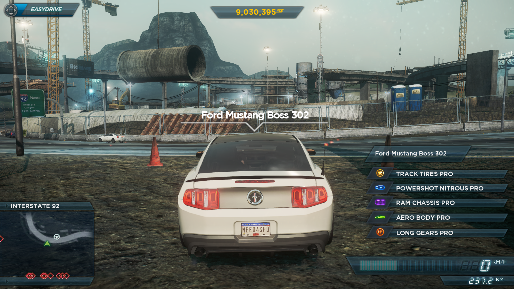

## Need for Speed Most Wanted save game file

### Progress
- [⭯](https://github.com/ankurparihar/NFSMW2-SaveGame/tree/40bc7ee178de5371aa12c8a3607d7e1a121e2f3f) Fresh start
- [⭯](https://github.com/ankurparihar/NFSMW2-SaveGame/tree/782b62d8da858abbbe7cd939872ee663a6e63a0e) Unlocking DLC Save
- [⭯](https://github.com/ankurparihar/NFSMW2-SaveGame/tree/ff4bc96be4239957fe592762e49f45394ee67fc0) Alfa Romeo Mito QV
- [⭯](https://github.com/ankurparihar/NFSMW2-SaveGame/tree/14adf46af436904b91c18780beb9128003cce5fb) Subaru Cosworth Impreza
- [⭯](https://github.com/ankurparihar/NFSMW2-SaveGame/tree/8e42b8843ed54ad6faaad647c5a78a8decde0e70) Audi A1 clubsport quattro
- [⭯](https://github.com/ankurparihar/NFSMW2-SaveGame/tree/ee32b3a0c595f5fc4fc34eb61f2451166e7e8f82) Tesla Roadster Sport
- [⭯](https://github.com/ankurparihar/NFSMW2-SaveGame/tree/33c664bd4e80cf7fc799f47e67ee05a05ed72cdb) Chevrolet Corvette ZR1
- [⭯](https://github.com/ankurparihar/NFSMW2-SaveGame/tree/5e2e7d334b8613581f582005ea17a2da44a19afe) Range Rover Evoque
- [⭯](https://github.com/ankurparihar/NFSMW2-SaveGame/tree/87c9645f0eb269993459283d0fa30e9a8e548f31) Ford F-150 SVT Raptor
- [⭯](https://github.com/ankurparihar/NFSMW2-SaveGame/tree/889fba7f17a0c2eb6ae3fd3721f384ea90c534db) Lancia Delta HF Integrale
- [⭯](https://github.com/ankurparihar/NFSMW2-SaveGame/tree/7b9cee06b1c9bbeff52204b2654331fddbbec697) Ford Focus RS500
- [⭯](https://github.com/ankurparihar/NFSMW2-SaveGame/tree/272532562101819bfca5ef33dde0486837a5f612) Caterham Superlight R500
- [⭯](https://github.com/ankurparihar/NFSMW2-SaveGame/tree/c9526bc2386f6ea61be0c2401c03243e6035b04d) Bentley Supersports ISR
- [⭯](https://github.com/ankurparihar/NFSMW2-SaveGame/tree/203d9929a395ec2c841b846b61ce8771036f0994) Jaguar XKR
- [⭯](https://github.com/ankurparihar/NFSMW2-SaveGame/tree/e3aa900dbfa6f330399e3c3b9bc5b27259a06324) Aston Martin DB5
- [⭯](https://github.com/ankurparihar/NFSMW2-SaveGame/tree/434605adfb2b37e3cf0958ef733ee219529d9282) Bugatti Veyron Vitesse
- [⭯](https://github.com/ankurparihar/NFSMW2-SaveGame/tree/614545168bdddb4685edc5aa70a6c92b639b6f91) Mercedes-Benz SLS AMG
- [⭯](https://github.com/ankurparihar/NFSMW2-SaveGame/tree/1096bda976e82062c17c86e4c69824c27ec143ea) Marussia B2
- [⭯](https://github.com/ankurparihar/NFSMW2-SaveGame/tree/0f6d4a2428fe8f6ef64d5673e912e9a43b968ca9) Maserati GT MC Stradale
- [⭯](https://github.com/ankurparihar/NFSMW2-SaveGame/tree/1937e9713a13d83425721c360431f1ed9057a934) BMW M3 Coupe
- [⭯](https://github.com/ankurparihar/NFSMW2-SaveGame/tree/2ffbc3494b6a62df164c1e06290e0c2cfa31aa9c) Ford GT
- [⭯](https://github.com/ankurparihar/NFSMW2-SaveGame/tree/8bea21f0d94e654a313ca76944a6d8236df820a6) Chevrolet Camaro ZL1
- [⭯](https://github.com/ankurparihar/NFSMW2-SaveGame/tree/74bebe3e0a2fc607479ba3b050123f75c65f7bde) Mitsubishi EVOLUTION X
- [⭯](https://github.com/ankurparihar/NFSMW2-SaveGame/tree/ecbe88d3212eb8b1b0447a3cdb4ffb7c6a1169eb) BMW 1 Series M Coupe
- [⭯](https://github.com/ankurparihar/NFSMW2-SaveGame/tree/d262f274e4c9cc1b418843f0c4f368214f40596a) SRT Viper GTS
- [⭯](https://github.com/ankurparihar/NFSMW2-SaveGame/tree/f1c416ac2ace44eaa646f652635e151522677133) Audi R8 GT Spyder
- [⭯](https://github.com/ankurparihar/NFSMW2-SaveGame/tree/984680c8c372b3127d5276b537a57ff132b49a71) Aston Martin V12 Vantage
- [⭯](https://github.com/ankurparihar/NFSMW2-SaveGame/tree/9c7de7dd8a20cbee58d0f495e3f36014d5f4125b) Ford Fiesta ST
- [⭯](https://github.com/ankurparihar/NFSMW2-SaveGame/tree/b34ade89ad59e6d00e0873c7ee93e1b83b22ace5) Audi RS3 Sportback
- [⭯](https://github.com/ankurparihar/NFSMW2-SaveGame/tree/ef48c26f6aa6b566fc4d4f74a2488584195c07e1) Aston Martin DBS
- [⭯](https://github.com/ankurparihar/NFSMW2-SaveGame/tree/636548aeedfc0ca6e0177270f4dfe58af12ffbcd) Pagani Zonda R
- [⭯](https://github.com/ankurparihar/NFSMW2-SaveGame/tree/c27534ad38daed2dc704e6e09960e6fe12a07a3e) McLaren F1 LM
- [⭯](https://github.com/ankurparihar/NFSMW2-SaveGame/tree/6f32fb12d6b22865f59c3ea41c3bc7e5527ddfb6) Pontiac Firebird T/A
- [⭯](https://github.com/ankurparihar/NFSMW2-SaveGame/tree/217ffac1470938c09dd285538a4a2d5be53d4188) Dodge Charger R/T
- [⭯](https://github.com/ankurparihar/NFSMW2-SaveGame/tree/38829626542fb91ac78b1168edc558d30cce9dfd) Ariel Atom 500 V8
- [⭯](https://github.com/ankurparihar/NFSMW2-SaveGame/tree/a604e59bc0b1199c791296b613a48f0181789c62) BAC Mono
- [⭯](https://github.com/ankurparihar/NFSMW2-SaveGame/tree/2aef6e9d5573d5971a1a7fd4a15419145863aab1) NISSAN GT-R EGOIST
- [⭯](https://github.com/ankurparihar/NFSMW2-SaveGame/tree/3fe642cc8c86a6a107d8f628f1cee244b9edda73) NISSAN 350Z
- [⭯](https://github.com/ankurparihar/NFSMW2-SaveGame/tree/57057408292ddae78c487dce0b668efc4f284ec2) NISSAN SKYLINE GT-R (R34)
- [⭯](https://github.com/ankurparihar/NFSMW2-SaveGame/tree/f89fb3edb48eaf779a14bd2efe0299bfee40c4ef) Lamborghini Diablo SV
- [⭯](https://github.com/ankurparihar/NFSMW2-SaveGame/tree/ad15dc171ff1e8581974cc2eb291dce0d7d648af) Porsche 911 Turbo 3.0
- [⭯](https://github.com/ankurparihar/NFSMW2-SaveGame/tree/a5d6fa03f99df7bcd5faabb1732bb71921fcafd8) Porsche Panamera Turbo S
- [⭯](https://github.com/ankurparihar/NFSMW2-SaveGame/tree/3d099b08c1815852b7d35b694c6acbdbf48db4eb) Porsche 911 GT2
- [⭯](https://github.com/ankurparihar/NFSMW2-SaveGame/tree/4da30b41534b5f59ed8e0507d392b6227e1da704) Alfa Romeo 4C Concept
- [⭯](https://github.com/ankurparihar/NFSMW2-SaveGame/tree/6c22c6fffa5f6261d32405059fb9cca4ae59bce8) Shelby COBRA 427 ®
- [⭯](https://github.com/ankurparihar/NFSMW2-SaveGame/tree/62f6dfc0e10af1edf600dbacc4216fc474df4560) Porsche 911 Carrera S
- [⭯](https://github.com/ankurparihar/NFSMW2-SaveGame/tree/83c8cf63b7a8b7ffddacefb15ba49ce131f9ba1a) Mercedes-Benz SL 65 AMG
- [⭯](https://github.com/ankurparihar/NFSMW2-SaveGame/tree/aef7769bd6688a875f9edf1e383c89f4394d10d4) Ford Mustang Boss 302
- [⭯](https://github.com/ankurparihar/NFSMW2-SaveGame/tree/f008f50f6b23311a83e65cb4ee4e1c3a10b9ff04) Dodge Challenger SRT8
- [⭯](https://github.com/ankurparihar/NFSMW2-SaveGame/tree/3f9de4a3690b5f6c0435f36ba843f0540309fbdd) Lexus LFA
- [⭯](https://github.com/ankurparihar/NFSMW2-SaveGame/tree/6bce3f8d5b539b321effc3745be2a6ad21a8a556) Hennessey Venom GT Spyder
- [⭯](https://github.com/ankurparihar/NFSMW2-SaveGame/tree/f78159f9536b4908d26897e3ba5b52aad00d7f4a) Lamborghini Countach
- [⭯](https://github.com/ankurparihar/NFSMW2-SaveGame/tree/f90020caa22bef2c6849a321a478e292ab793aa3) Lamborghini Gallardo
- [⭯](https://github.com/ankurparihar/NFSMW2-SaveGame/tree/a89bec9afe2d2cd01e92992962d0fb086d1ddc7b) McLaren MP4-12C
- Porsche 918 Spyder Concept

### Screenshot
